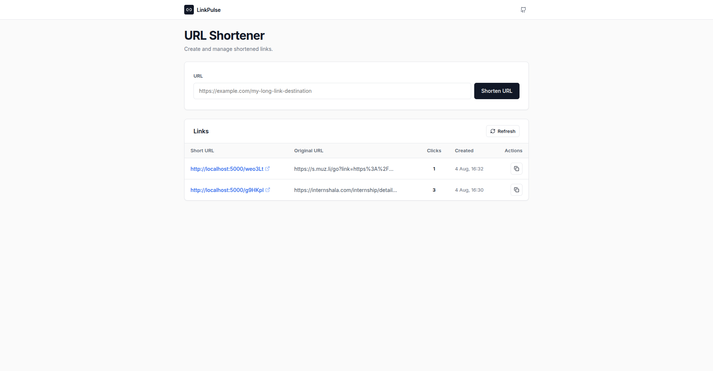

# LinkPulse — URL Shortener

> A full-stack URL shortener built with React, Express, and MongoDB.

---

## Project Goals

This project was built as part of a Full Stack Developer assignment.

The objective was to create a clean, maintainable URL shortener demonstrating:
- React SPA frontend with responsive design
- RESTful API design with clean JSON envelopes
- MongoDB integration & URL deduplication
- 302 redirects with automatic click tracking
- Layered project structure (Controller-Service-Model)

---

## Screenshot



---

## Live Demo

- **Frontend**: https://linkpulse-sigma.vercel.app
- **Backend API**: https://linkpulse-159i.onrender.com
- **Health Check**: https://linkpulse-159i.onrender.com/health

---

## Key Features

- **Shorten URLs**: Instant short code generation for any valid http:// or https:// destination.
- **URL Deduplication**: Submitting a previously shortened destination returns the existing short link instead of creating duplicate records.
- **Click Counter**: Atomic $inc update tracking redirects for every link.
- **Clipboard Copy**: One-click short link copying with instant Copied! tooltip feedback.
- **Health Check**: Dedicated `/health` endpoint reporting server uptime and database connection status.

---

## Tech Stack

- **Frontend**: React 18, Vite, Inter Font, Lucide Icons, Vanilla CSS
- **Backend**: Node.js, Express 4, MongoDB (Mongoose 8), Helmet, Cors, Morgan
- **Testing**: Vitest, Supertest, React Testing Library

---

## Deployment

- Frontend deployed on Vercel (`https://linkpulse-sigma.vercel.app`)
- Backend deployed on Render (`https://linkpulse-159i.onrender.com`)
- Database hosted on MongoDB Atlas / in-memory cluster

---

## Architecture

The backend follows a layered architecture:

```
Controller  ──►  Service  ──►  Model  ──►  MongoDB
```

- **Controller**: Parses HTTP request parameters and formats responses.
- **Service**: Executes core business logic, deduplication, and code generation.
- **Model**: Manages database queries, Mongoose schemas, and indexes.

This keeps request handling, business logic, and database access separated, making the codebase maintainable and testable.

---

## Design Decisions

**Why MongoDB?**
MongoDB was chosen because each shortened link is represented as a single document, making reads and updates straightforward. A unique index on `shortCode` enables efficient lookups during redirects, while an index on `originalUrl` speeds up deduplication checks.

---

## Environment Variables

### Backend (`backend/.env`)
```env
PORT=5000
MONGO_URI=<your-mongodb-uri>
BASE_URL=https://linkpulse-159i.onrender.com
```

### Frontend (`frontend/.env`)
```env
VITE_API_BASE_URL=https://linkpulse-159i.onrender.com
```

---

## Repository Structure

```
├── backend/
│   ├── src/
│   │   ├── config/          # DB connection & environment settings
│   │   ├── controllers/     # HTTP route handlers
│   │   ├── services/        # Business logic & URL deduplication
│   │   ├── models/          # Mongoose Link schema & indexes
│   │   ├── routes/          # API route definitions
│   │   ├── middleware/      # Global error handler & async wrapper
│   │   ├── utils/           # ApiError class & short code generator
│   │   └── validators/      # Native URL input validation
│   └── tests/               # Unit & integration tests
├── docs/                    # Screenshots and documentation assets
├── frontend/                # React SPA source code
├── start.sh                 # macOS/Linux launcher
└── start.bat                # Windows launcher
```

---

## Quick Start

### 1. Launch Dev Environment
Run both backend and frontend concurrently:
```bash
./start.sh
```
Or on Windows:
```cmd
start.bat
```

### 2. Run Test Suites
```bash
# Backend unit & integration tests
cd backend && npm test

# Frontend component tests
cd frontend && npm test
```

---

## API Reference

| Method | Endpoint | Description |
| :--- | :--- | :--- |
| `GET` | `/health` | Server uptime & database connection status |
| `POST` | `/api/v1/links` | Create a short link (or return existing link) |
| `GET` | `/api/v1/links` | List all links in newest-first order |
| `GET` | `/:shortCode` | Redirect (302) to original URL & increment click count |

---

## Future Improvements

- Custom short code aliases (e.g. `/:custom-alias`)
- Link expiration dates
- User authentication & workspace management
- QR code generation for shortened links
- Detailed analytics dashboard (clicks over time, referrers)
