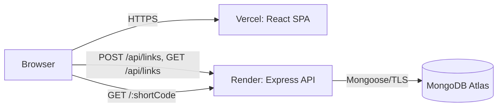

# URL Shortener — Project Overview

## Vision

Deliver a small, dependable URL shortener whose behavior is obvious: a user submits an absolute web URL, receives a stable short link, and can see the accumulated redirect count. The product is deliberately narrow so its reliability, operability, and code clarity are stronger than its feature count.

## Goals

| Goal | Measure |
| --- | --- |
| Create links quickly | Valid submission returns a short URL in one request. |
| Redirect correctly | A known code produces an HTTP redirect to its stored destination. |
| Count traffic safely | Each successful redirect increments the counter once. |
| Make links inspectable | The home page lists links, destinations, short URLs, creation time, and clicks. |
| Be deployable independently | Vercel frontend, Render API, and Atlas database are independently configurable. |

## Non-goals

- User accounts, teams, billing, custom domains, QR codes, analytics by visitor, link expiry, editing, or deletion in the first release.
- Malware/reputation scanning, destination previews, and guaranteed global analytics precision.
- A general-purpose marketing analytics platform.

## Functional requirements

1. Accept an `http` or `https` absolute URL.
2. Generate a collision-resistant, URL-safe short code and return the public short URL.
3. Resolve `GET /:shortCode` to the stored destination with a temporary redirect.
4. Atomically increment click count only when a stored link is found and a redirect is issued.
5. List created links in deterministic newest-first order.
6. Present validation, loading, empty, and recoverable failure states in the UI.

## Non-functional requirements

- **Availability:** redirect path has no frontend dependency.
- **Performance:** API p95 target under 300 ms excluding network transit; redirect p95 under 200 ms at modest launch load.
- **Correctness:** unique codes and atomic counters.
- **Security:** strict URL validation, request limits, security headers, narrow CORS, secrets outside source control.
- **Accessibility:** keyboard-operable controls, visible focus, labels, semantic table/list equivalents, and status announcements.
- **Operability:** structured logs, request IDs, health endpoint, actionable error payloads.

## Constraints and assumptions

- Build target is 2–3 hours; therefore launch uses one `links` collection and no authentication.
- MongoDB Atlas is the system of record; no cache is required initially.
- Public short links are served by the Render backend domain (or a future configured short domain), not by the Vercel SPA.
- Codes are opaque. The implementation must not derive them from a URL or database ID.

## Success criteria

- A valid URL can be shortened, copied, opened, redirected, and observed in the list with an incremented count.
- Invalid URLs never reach persistence and return a clear `400` response.
- Unknown codes return a consistent `404` response without incrementing anything.
- The deployment uses environment-specific configuration and passes a smoke test after release.

## Technology choices

| Area | Choice | Why |
| --- | --- | --- |
| UI | React + Vite + CSS | Fast development, small surface area, deploys cleanly to Vercel. |
| API | Node.js + Express | Mature middleware ecosystem and direct control over redirect semantics. |
| Data | MongoDB + Mongoose | Flexible document model; unique indexes and atomic `$inc` suit this workload. |
| Hosting | Vercel + Render + Atlas | Separates static delivery, long-running API, and managed persistence. |

## High-level architecture

The browser calls the API for management actions. A visitor follows the short link directly to Express, avoiding an unnecessary SPA hop and preserving standard HTTP redirect behavior.
