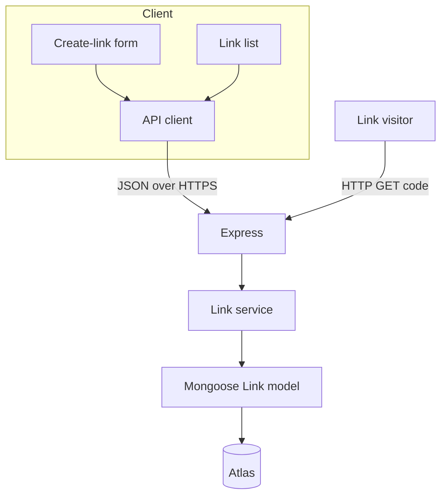
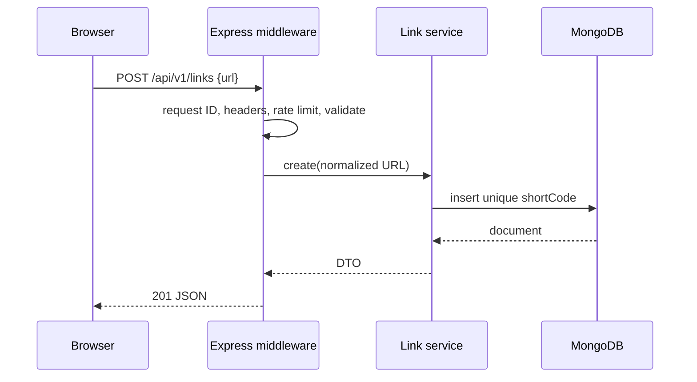
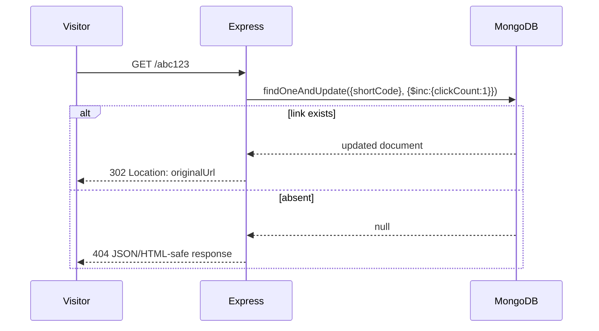
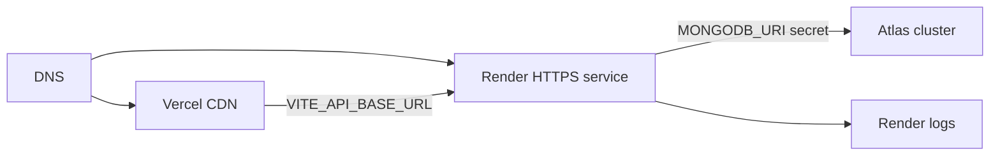

# System Architecture

## Overall design

The system has three deployable boundaries: a static React client, a stateless Express service, and MongoDB Atlas. The API owns validation, code generation, persistence, redirect logic, and error contracts. The client owns presentation and transient UI state only.

## Client/server communication

Management endpoints are JSON, versioned under `/api/v1`, and use a predictable envelope. Redirects are deliberately outside that namespace: `GET /:shortCode`. This avoids route ambiguity and makes the public URL short. The Vercel origin is explicitly allowlisted by CORS; browser credentials are unnecessary and must not be sent.

## Request lifecycle

## Redirect lifecycle

`findOneAndUpdate` makes lookup and increment one atomic database operation. It prevents lost increments caused by read-modify-write races. A 302 is chosen because destinations may change in a future edit feature and clients should not permanently cache the mapping. A future product decision can switch to 301/307.

## Data flow and boundaries

- The API normalizes URLs before storage and returns a DTO, never raw Mongoose documents.
- The frontend persists no business data locally. A successful creation updates in-memory list state; a refresh reloads authoritative data.
- Atlas is private to the API via credentials and network controls. The browser never connects to Atlas.

## Deployment architecture

Configure a distinct preview/staging/production API base URL. API CORS must list only corresponding frontend origins. Health checks use `/health`, which does not disclose database credentials or internals.

## Scalability and extensibility

At launch, an indexed code lookup is O(log n) and the service scales horizontally because it stores no session state. Atlas connection pooling should be bounded per instance. Higher traffic can add a cache for resolved destinations, event-based analytics, a queue for non-critical reporting, and a CDN/custom domain. Do not cache the click increment without an explicitly accepted eventual-consistency model.

Likely extensions—authentication, custom aliases, expiry, and destinations edits—belong in additive fields/collections and service methods. Keep API versioning from day one so future contracts do not silently break clients.
