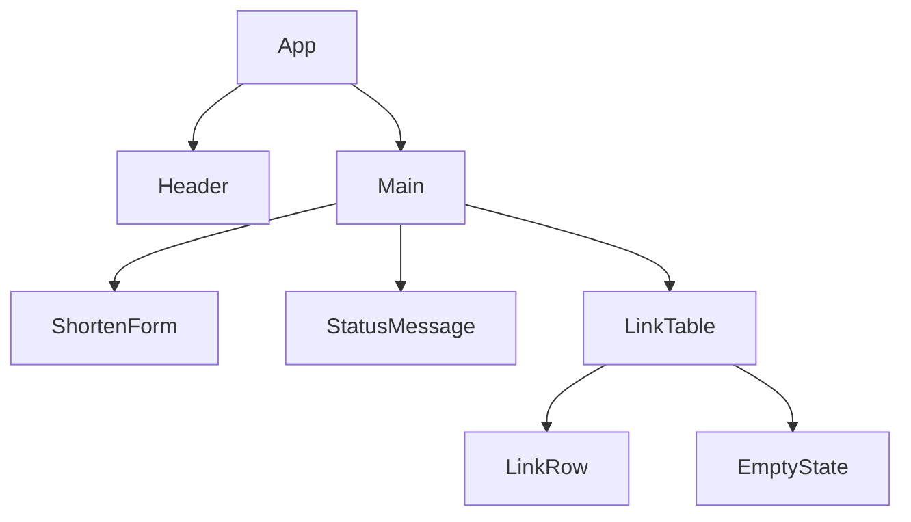

# Frontend Architecture

## Structure and ownership

```text
frontend/src/
  main.jsx                 # React bootstrap
  App.jsx                  # page composition
  components/
    ShortenForm.jsx        # controlled URL input and submission
    LinkTable.jsx          # semantic list/table of links
    LinkRow.jsx            # one link; copy interaction
    StatusMessage.jsx      # success/error/live announcements
    EmptyState.jsx         # no-link guidance
    LoadingIndicator.jsx   # non-blocking progress UI
  api/linksApi.js          # fetch wrapper and response mapping
  hooks/useLinks.js        # load/create state transitions
  styles/                  # tokens, global styles, component styles
  utils/                   # formatting and clipboard-safe helpers
```

For this single screen, local React state plus a focused `useLinks` hook is preferable to Redux/query libraries. It keeps data ownership explicit without introducing a global store. Reconsider a server-state library when pagination, caching, mutations across routes, or optimistic updates become material.

## Component hierarchy



`App` coordinates page-level state. `ShortenForm` owns only draft input and calls an injected submit handler. `LinkTable` is presentational and gets records/loading/error as props. `LinkRow` formats values and copies the server-provided `shortUrl`; it never reconstructs public URLs in the browser.

## State model

```mermaid
stateDiagram-v2
  [*] --> Loading
  Loading --> Ready: list succeeds
  Loading --> LoadError: list fails
  LoadError --> Loading: retry
  Ready --> Submitting: valid form submit
  Submitting --> Ready: create succeeds; prepend result
  Submitting --> Ready: create fails; preserve draft and show error
```



Initial list loading must not erase the form. Submit disables only the submit control, prevents duplicate posts, preserves the typed URL on error, clears it on success, and moves keyboard focus to a concise success status. A stale list failure remains recoverable with a retry control.

## API and error handling

`linksApi` uses the build-time `VITE_API_BASE_URL`, sends `Content-Type: application/json`, uses an `AbortController` timeout, and maps non-2xx responses into a small typed/normalized client error object. It must distinguish validation errors (near the input) from network/server errors (page-level retryable message). Do not display raw server internals.

## Responsive and styling strategy

Use plain CSS with tokens for spacing, color, type scale, focus ring, borders, and breakpoints. Prefer fluid container widths and a table that becomes stacked labeled rows or horizontally scrollable at narrow widths; choose one pattern and test it. Maintain semantic HTML first, then CSS. Avoid component-library lock-in for a deliberately compact UI.
