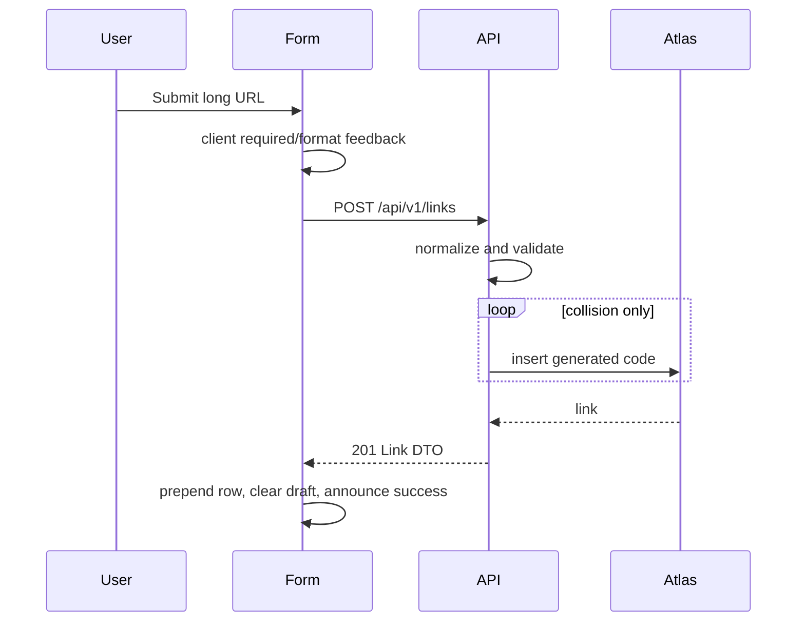
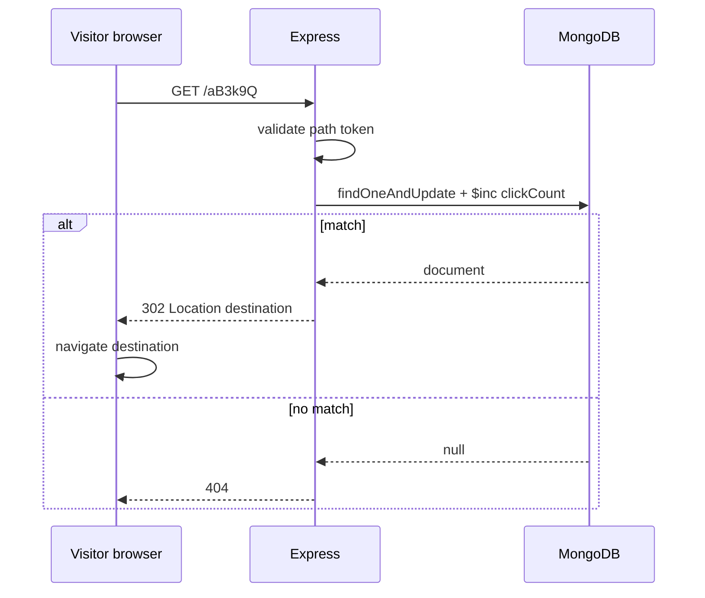

# Data Flow

## Create short URL

The client may give immediate usability feedback but the server is the security and persistence authority. A collision is retried internally and is not exposed as a user error unless retries are exhausted.

## Load homepage / fetch links

On initial render, the page enters `Loading`, requests `GET /api/v1/links`, then displays sorted data, an empty state, or a retryable error. The server applies newest-first sort. This prevents client-side ordering drift and keeps a future pagination contract natural.

## Redirect and increment

The increment occurs before the response. Thus a reported click means the service resolved the link, not that the visitor's destination fully loaded. That definition must remain explicit in product copy.
