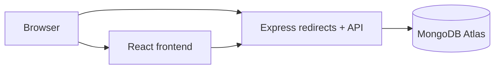

# URL Shortener

A focused full-stack URL shortener: create links, follow public short URLs, count redirects, and view the link list. The project uses React/Vite/CSS, Express, MongoDB/Mongoose, Vercel, Render, and MongoDB Atlas.

## Architecture

The frontend manages the creation/list experience. The backend owns link generation, validation, redirects, and counting. See [01_Project_Overview.md](01_Project_Overview.md), [05_API_Specification.md](05_API_Specification.md), and [11_Deployment_Guide.md](11_Deployment_Guide.md) for the engineering contract.

## Features

- Create a URL-safe short code for an HTTP(S) destination.
- Redirect by short code and atomically count redirect requests.
- List links with destination, short URL, timestamps, and click counts.
- Accessible loading, empty, validation, and failure states.

## Screenshots

<!-- Add screenshots after implementation. Suggested files: docs/images/home.png and docs/images/error-state.png. -->

## Local setup

Prerequisites: current Node.js LTS, a MongoDB Atlas database (or local MongoDB), and package-manager lockfiles committed by the implementation.

1. Copy backend and frontend environment examples to their local `.env` files.
2. Set the backend `MONGODB_URI`, `CORS_ORIGIN`, and `PUBLIC_BASE_URL`.
3. Set frontend `VITE_API_BASE_URL` to the local backend origin.
4. Install dependencies and run the backend and Vite dev server using the package scripts established during implementation.

Expected environment variables are documented in [11_Deployment_Guide.md](11_Deployment_Guide.md). Never commit `.env` files or Atlas credentials.

## API

| Method | Route | Purpose |
| --- | --- | --- |
| `POST` | `/api/v1/links` | Create a short link. |
| `GET` | `/api/v1/links` | List links newest first. |
| `GET` | `/:shortCode` | Increment and redirect. |
| `GET` | `/health` | Service health. |

Detailed request/response contracts and failure behavior are in [05_API_Specification.md](05_API_Specification.md).

## Testing and deployment

Run unit, API integration, frontend component, and end-to-end smoke tests before deployment; the test matrix is in [10_Testing_Strategy.md](10_Testing_Strategy.md). Deploy the backend to Render, frontend to Vercel, and persistence to Atlas following [11_Deployment_Guide.md](11_Deployment_Guide.md). Confirm CORS from the deployed Vercel origin and exercise create → redirect → count.

## Future improvements

Authentication/link ownership, custom aliases/domains, expiry, pagination, abuse monitoring, analytics events, and a shared rate-limit/cache store are intentionally deferred. Their architectural considerations are documented in [02_System_Architecture.md](02_System_Architecture.md) and [12_Security.md](12_Security.md).
